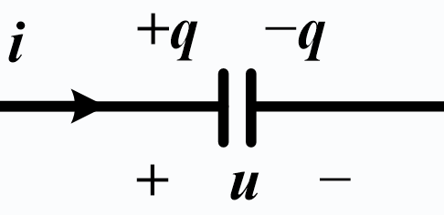

# 一阶动态电路的暂态分析

## 2.1 电容元件与电感元件

### 2.1.1 电容元件

电容元件是从实际的电容器抽象而来

**电容量**（常简称为**电容**）是描述电容元件的参数，用 C 表示，单位为法拉（F）

电容器的主要参数有：**标称容量**、**允许偏差**和**工作电压**

电容器在使用时，容许加在其两端的最大电压值称为**工作电压**，也称**耐压**

电容的电路符号如图所示：

在关联参考方向下，电容的**伏安特性**为
$$
i_c(t)=\frac{dq}{dt}=\frac{d[Cu_c(t)]}{dt}=C\frac{du_c(t)}{dt}（正比于电压变化率）
$$
电容元件的**伏安关系**是一个微分关系

电容是一个**动态元件**

当电容两端的电压保持不变，则通过它的电流为零

对直流电压而言，电容相当于开路，因此电容具有隔断直流的作用
$$
i_{\mathrm{C}}(t)=C \frac{\mathrm{d} u_{\mathrm{C}}(t)}{\mathrm{d} t} \Rightarrow u_{\mathrm{C}}(t)=u_{\mathrm{C}}\left(t_{0}\right)+\frac{1}{C} \int_{t_{0}}^{t} i_{\mathrm{C}}(\tau) \mathrm{d} \tau
$$
无源器件：
$$
w_{\mathrm{C}}(t)=\int_{-\infty}^{t} p(\lambda) \mathrm{d} \lambda=\int_{-\infty}^{t} C u \frac{\mathrm{d} u}{\mathrm{~d} \lambda} \mathrm{d} \lambda=\frac{1}{2} C u^{2}(t) \geq 0
$$
电容储存的能量只与当前时间电容两端的电压值有关

电容的电压反映了其储存能量的大小，将电压称为电容的**状态变量**

### 2.1.2 电感元件

电感元件是从实际的电感线圈或电感器元件抽象而来

**电感量**（常简称**电感**）是用于描述电感元件的参数，用 L 表示，单位是亨利（H）

常见电感器有磁芯环形电感、工字电感和色环电感等

电感器的主要参数：

1. **电感量**和容许误差
2. **品质因数**，用 Q 表示，Q 值越大，线圈的损耗越小，效率越高
3. **标称电流**（**额定电流**）是指电感线圈在正常工作时，容许通过的最大电流

在关联参考方向下，电感的伏安特性为
$$
u_L(t)=L\frac{di_L(t)}{dt}（正比于电流变化率）
$$
电感元件的伏安特性是一个微分关系

当流过电感的电流保持不变，则其两端的电压为零

对直流电流而言，电感相当于短路
$$
u_{\mathrm{L}}(t)=L \frac{\mathrm{d} i_{\mathrm{L}}(t)}{\mathrm{d} t} \quad \Rightarrow \quad i_{\mathrm{L}}(t)=i_{\mathrm{L}}\left(t_{0}\right)+\frac{1}{L} \int_{t_{0}}^{t} u_{\mathrm{L}}(\tau) \mathrm{d} \tau
$$
电感元件以磁场能的形式存储能量

无源器件：
$$
\boldsymbol{w}_{\mathrm{L}}(\boldsymbol{t})=\int_{-\infty}^{t} \boldsymbol{p}(\lambda) \mathrm{d} \lambda=\int_{-\infty}^{t} \boldsymbol{L} \boldsymbol{i} \frac{\mathrm{d} i}{\mathbf{d} \lambda} \mathbf{d} \lambda=\frac{1}{2} \boldsymbol{L} \boldsymbol{i}^{2}(\boldsymbol{t}) \geq 0
$$
电感存储的能量只与当前时间流过电感的电流值有关 

电感的电流反映了其存储能量的大小，将电流称为电感的**状态变量** 

## 2.2 换路定则及其初始条件

### 2.2.1 换路定则

#### 换路

电路中开关的接通、断开，元件参数的变化统称为**换路**

换路会使电路从一个状态过渡到另一个状态（因为储能元件的能量变化需要时间），这个过程称为**过渡过程**

储能元件电压与电流是微分关系，分析动态电路要列解微分方程。含有一个储能元件的电路列出的是一阶微分方程，因此含有一个储能元件的电路称为**一阶电路**

#### 基本概念

$0_{+}$ 换路前一瞬间

$0_{-}$ 换路后一瞬间

初始条件为 $t=0_{+}$ 时，u，i 的值，也称为**初始值**

由于物体所具有的能量不能跃变，因此，在换路瞬间储能元件的能量也不能跃变，由
$$
W_C=\frac{1}{2}Cu^2_C,\quad W_L=\frac{1}{2}Li^2_L
$$
可见，电容电压 $u_c$ 和电感电流 $i_L$ 不能跃变

**换路定则**：换路时电容上的电压，电感上的电流不能跃变，即
$$
u_c(0_+)=u_c(0_-)\\
i_L(0_+)=i_L(0_-)
$$

#### 初始值的计算过程

1. 先由 $t=0_-$ 等效电路求出 $u_c(0_-)$、$i_L(0_-)$ （电容 $\rightarrow $开路，电感 $\rightarrow$ 短路
2. 根据换路定律，求出独立变量初始值 $u_c(0_+)$ 和 $i_L(0_+)$
3. 画出在 $t=0_+$ 时刻的等效电路：用电压源代替电容，电流源代替电感
4. 求出各个变量的值

## 2.3 一阶电路的零输入响应

响应：电路在激励（外界输入）或储能元件的初始状态作用下产生的输出

### 2.3.1 RC电路的零输入响应

令 $\tau=RC$，得到图 (b) 电路的零输入响应为
$$
u_{\mathrm{C}}(t)=U_{0} \mathrm{e}^{-\frac{t}{\tau}}=u_{\mathrm{C}}\left(0_{+}\right) \mathrm{e}^{-\frac{t}{\tau}} \quad(t \geq 0)\\
i=\frac{u_{\mathrm{R}}}{R}=\frac{u_{\mathrm{C}}}{R}=\frac{U_{0}}{R} e^{-\frac{t}{\tau}}=I_{0} e^{-\frac{t}{\tau}}
$$

当 $t=\tau$ 时，$u_c=U_0e^{-1}=0.368\cdot U_0$

称 $\tau$ 为一阶电路的时间常量

1. $\tau$ 具有时间的量纲，单位是 s

2. **时间常数** $\tau$ 反映了电路过渡过程时间的长短

3. 时间常数 $\tau$ 等于曲线的次切距长度

   

工程上认为 $t=(3 \sim 5)\tau$，$u_c\rightarrow0$ 电容放电基本结束

### 2.3.2 RL电路的零输入响应

令 $\tau=\frac{L}{R}$，则零输入响应为
$$
i_L(t)=I_0e^{-\frac{R}{L}t}=i_L(0_+)e^{-\frac{t}{\tau}}\\
u_L(t)=L\frac{di_L}{dt}=-RI_0e^{-\frac{t}{\tau}}\quad t>0
$$

## 2.4 一阶电路的零状态响应

电路的初始状态为零，由外加激励引起的响应

### 2.4.1 RC 电路的零状态响应

$$
u_c(t)=U_s-U_se^{-\frac{t}{\tau}}\\
i_c(t)=\frac{U_s}{R}e^{-\frac{t}{\tau}}
$$

电容电压由两部分组成：稳态分量、暂态分量

响应和激励成比例关系，响应与多个外加激励成线性关系（可叠加）

### 2.4.2 RL 电路的零状态响应

$$
i_L(t)=\frac{U_s}R-\frac{U_s}Re^{-\frac{t}{\tau}}\\
u_L(t)=U_se^{-\frac{t}{\tau}}
$$

## 2.5 一阶电路的完全响应

由初始状态和外界激励共同引起的响应称为完全响应，简称全响应

### 2.5.1 RC 电路的完全响应

$$
u_c(t)=U_S+(U_0-U_S)e^{-\frac{t}{\tau}}\\
\Downarrow\\
u_c(t)=u_c(0_+)e^{-\frac{t}{\tau}}+u_c(\infty)(1-e^{-\frac{t}{\tau}})
$$

上方式子可以解释为：稳态分量 + 暂态分量

下方式子可以解释为：全相应 = 零输入 +  零状态（是叠加定理的一种体现）

### 2.5.2 RL 电路的完全响应

$$
i_L(t)=i_L(\infty)+[i_L(0_+)-i_L(\infty)]e^{-\frac{t}{\tau}}=\frac{U_S}R+[\frac{U_0}{R_0}-\frac{U_S}R]e^{-\frac{t}{\tau}}
$$

## 2.6 三要素法求一阶电路响应

*初始值* $f(0_+)$，*稳态值* $f(\infty)$ 和*时间常数* $\tau$ 称为电路的**三要素**
$$
f(t)=f(\infty)+[f(0_+)-f(\infty)]e^{-\frac{t}{\tau}}
$$
**适用范围**：

1. 直流电源激励下
2. 一阶线性动态电路
3. 电路中任何电压和电流

**基本步骤**：

1. 求初始值 $f(0_+)$
2. 求稳态值 $f(\infty)$
3. 求时间常数 $\tau$
4. 求一阶电路响应