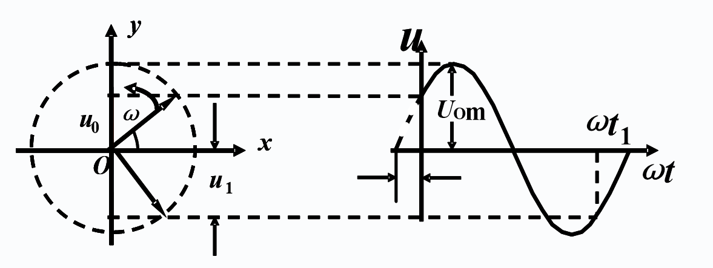

# 正弦稳态电路的分析

## 3.1 正弦交流电的基本概念

正弦交流电瞬时值的一般表达式为：
$$
u=U_msin(\omega t+\theta_u)\\
i=I_msin(\omega t+\theta_i)
$$
可见，每个正弦量包含三个基本要素：

1. 最大值 / 幅值（$U_m$、$I_m$）
2. 角频率 $\omega$
3. 初相位（$\theta_u$、$\theta_i$）

交流电的**有效值**：

与交流电热效应想等的直流电定义为该交流电的有效值，用大写字母 I、U 表示
$$
RI^2=\frac1T\int^T_0Ri^2dt\Rightarrow I=\sqrt{\frac1T\int^T_0i^2dt}
$$
将 正弦函数 i （交流电）带入公式可得：
$$
I_m=\sqrt2 I\\
U_m=\sqrt2I
$$
相位差 $\phi=\theta_u-\theta_i=0^0$ 时，电压与电流相同；$\phi=\theta_u-\theta_i=180^0$ 时，电压与电流相反

## 3.2 正弦量的相量表示

**旋转矢量法**：

在平面坐标上的一个旋转矢量可以表示出正弦量的三个要素

设正弦量为 $u=U_msin(\omega t+\theta)$

- 该旋转的矢量在 y 轴上投影的长度即为正弦量的值
- 矢量与 x 轴的夹角为初相位

采用复数坐标 $A=a+jb$ ，a 为实部，b 为虚部

复数的模 $|A|=\sqrt{a^2+b^2}$

复数的幅角 $\theta =arctan\frac ba$

实部 $a=|A|cos\theta$

虚部 $b=|A|sin\theta$

**瞬时值**：
$$
u(t)=U_msin(\omega t+\theta)=\sqrt2Usin(\omega t+\theta)
$$
可以表示为：有效值向量 $\dot{U}=U \angle \theta$ 或者 $\dot{U}=Ue^{j\theta}$

相量是一个与时间无关的复值常数，所以它可以表示正弦量，但不等于正弦量

## 3.3 基尔霍夫定律的相量表示

$$
\sum\dot I=0\\
\sum\dot U=0
$$

## 3.4 三种基本元件伏安关系的相量表示

### 3.4.1 电阻元件

电压与电流的关系可以表示为 $\dot U=R\dot I$

设 $i=\sqrt2Isin\omega t$

则 $u=\sqrt2RIsin\omega t$

1. 频率相同
2. 有效值 $U=RI$
3. 相位关系为 $\theta_u=\theta_i$

### 3.4.2 电感元件

电压与电流的关系为 $u=L\frac{di}{dt}$

设 $i=\sqrt2Isin\omega t$

则 $u=\sqrt2Usin(\omega t+90^o)$

1. 频率相同

2. 有效值 $U=\omega LI$

   定义 $X_L=\omega L=2\pi fL$

   则 $U=X_L I$

3. 电压超前电流 $90^0$

$X_L$ 称为电感电抗，简称**感抗**，单位为欧姆

定义 
$$
X_L=\omega L=2\pi fL
$$

则 $U=X_L I$

$\dot U=j\omega L\dot I=jX_L\dot I$

这是电感电路中欧姆定律的相量形式，既表示了电压与电流有效值之间的关系，也反映了两者之间的相位差 

### 3.4.3 电容元件

