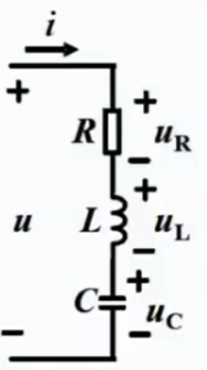
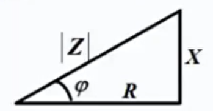

# 正弦稳态电路的分析

## 3.1 正弦交流电的基本概念

正弦交流电瞬时值的一般表达式为：
$$
u=U_msin(\omega t+\theta_u)\\
i=I_msin(\omega t+\theta_i)
$$
可见，每个正弦量包含三个基本要素：

1. 最大值 / 幅值（$U_m$、$I_m$）
2. 角频率 $\omega$
3. 初相位（$\theta_u$、$\theta_i$）

交流电的**有效值**：

与交流电热效应想等的直流电定义为该交流电的有效值，用大写字母 I、U 表示
$$
RI^2=\frac1T\int^T_0Ri^2dt\Rightarrow I=\sqrt{\frac1T\int^T_0i^2dt}
$$
将 正弦函数 i （交流电）带入公式可得：
$$
I_m=\sqrt2 I\\
U_m=\sqrt2I
$$
相位差 $\phi=\theta_u-\theta_i=0^0$ 时，电压与电流相同；$\phi=\theta_u-\theta_i=180^0$ 时，电压与电流相反

## 3.2 正弦量的相量表示

**旋转矢量法**：

在平面坐标上的一个旋转矢量可以表示出正弦量的三个要素

设正弦量为 $u=U_msin(\omega t+\theta)$

- 该旋转的矢量在 y 轴上投影的长度即为正弦量的值
- 矢量与 x 轴的夹角为初相位

采用复数坐标 $A=a+jb$ ，a 为实部，b 为虚部

复数的模 $|A|=\sqrt{a^2+b^2}$

复数的幅角 $\theta =arctan\frac ba$

实部 $a=|A|cos\theta$

虚部 $b=|A|sin\theta$

**瞬时值**：
$$
u(t)=U_msin(\omega t+\theta)=\sqrt2Usin(\omega t+\theta)
$$
可以表示为：有效值向量 $\dot{U}=U \angle \theta$ 或者 $\dot{U}=Ue^{j\theta}$

相量是一个与时间无关的复值常数，所以它可以表示正弦量，但不等于正弦量

## 3.3 基尔霍夫定律的相量表示

$$
\sum\dot I=0\\
\sum\dot U=0
$$

## 3.4 三种基本元件伏安关系的相量表示

### 3.4.1 电阻元件

电压与电流的关系可以表示为 $\dot U=R\dot I$

设 $i=\sqrt2Isin\omega t$

则 $u=\sqrt2RIsin\omega t$

1. 频率相同
2. 有效值 $U=RI$
3. 相位关系为 $\theta_u=\theta_i$

### 3.4.2 电感元件

电压与电流的关系
$$
u=L\frac{di}{dt}
$$

设 $i=\sqrt2Isin\omega t$

则 $u=\sqrt2Usin(\omega t+90^o)$

1. 频率相同

2. 有效值 $U=\omega LI$

   定义 $X_L=\omega L=2\pi fL$

   则 $U=X_L I$

3. 电压超前电流 $90^0$

$X_L$ 称为电感电抗，简称**感抗**，单位为欧姆

定义 
$$
X_L=\omega L=2\pi fL
$$

则 $U=X_L I$

$$
\dot U=j\omega L\dot I=jX_L\dot I
$$

这是电感电路中欧姆定律的相量形式，既表示了电压与电流有效值之间的关系，也反映了两者之间的相位差 

### 3.4.3 电容元件

电流与电压的关系
$$
i=\frac{dq}{dt}=C\frac{du}{dt}
$$
若
$$
U=\sqrt2Usin\omega t
$$
则
$$
i=\sqrt2U\omega Csin(\omega t+90^o)
$$

1. 频率相同
2. 有效值 $I=\omega CU$
3. 电流超前电压 $90^o$

因为 $U=\frac1{\omega C}I$

定义 $X_C=\frac1{\omega C}=\frac1{2\pi fC}$

则 $U=X_CI$

$X_C$ 称为电容电抗，简称为容抗，单位为欧姆

用相量的形式写出电容电压与电流的之间的关系为
$$
\dot U=-jX_C\dot I=-j\frac1{\omega C}\dot I=\frac{1}{j\omega C}\dot I
$$

### 3.4.4 小结

## 3.5 简单正弦交流电路

### 3.5.1 RLC 串流交流电路

设电流
$$
i=\sqrt2I sin\omega t
$$

则
$$
u_R=\sqrt2 RIsin(\omega t)\\
u_L=\sqrt2 \omega LIsin(\omega t+90^o)\\
u_C=\sqrt2 \frac1{\omega C}I sin(\omega t-90^o)
$$
对应的相量形式为
$$
\dot I=I\ang0^o\quad\dot U_R=R\dot I\\
\dot U_L=jX_L\dot I\quad \dot U_C=-jX_C\dot I
$$
由 KVL 可得
$$
\begin{aligned}
&\dot{U}=\dot{U}_{\mathrm{R}}+\dot{U}_{\mathrm{L}}+\dot{U}_{\mathrm{C}}=R \dot{I}+\mathrm{j} X_{\mathrm{L}} \dot{I}-\mathrm{j} X_{\mathrm{C}} \dot{I} \\
&=\left[R+\mathrm{j}\left(X_{\mathrm{L}}-X_{\mathrm{C}}\right)\right] \dot{I}=(R+\mathrm{j} X) \dot{I} \\
&=Z \dot{I}
\end{aligned}
$$
其中
$$
X=X_L-X_C
$$
是感抗与容抗之差，称为**电抗**，单位为欧姆

而
$$
Z=R+j(X_L-X_C)=R+JX
$$
称为**复阻抗**，简称**阻抗**，实部为电阻，虚部为电抗

复阻抗的模
$$
|Z|=\sqrt{R^2+X^2}=\sqrt{R^2+(\omega L-\frac1{\omega C})^2}
$$
复阻抗的辐角称为阻抗角
$$
\phi=arctan\frac XR
$$
R，X，|Z| 三者之间构成的直角三角形，称为阻抗三角形，如图

$$
Z=\frac{\dot U}{\dot I}=\frac UI\ang\theta_u-\theta_i
$$
感性电路：

- 当 $X_L >X_C$ 时，$X>0，\phi>0$，电压超前电流，电路呈电感性

容性电路：

- 当 $X_L <X_C$ 时，$X<0，\phi<0$，电压滞后电流，电路呈电容性

电阻性电路：

- 当 $X_L =X_C$ 时，$X=0，\phi=0$，电压与电流同相，电路呈电阻性

### 3.5.2 阻抗的串并联

#### 阻抗的串联

$$
 \dot U=(Z_1+Z_2\dot I)
$$

分压公式为
$$
\dot U_1=\frac{Z_1}{Z_1+Z_2}\dot U\quad\quad\dot U_2=\frac{Z_2}{Z_1+Z_2}\dot U
$$
显然，多个阻抗串联的等效阻抗为
$$
Z=Z_1+Z_2+Z_3+\cdots
$$
对应的分压公式
$$
\dot U_k=\frac{Z_K}{Z}\dot U
$$
**注意**：分电压可以大于总电压（由于虚部的存在）

#### 阻抗的并联

$$
\dot U=\frac{Z_1Z_2}{Z_!+Z_2}\dot I
$$

分流公式为
$$
\dot I_1=\frac{Z_2}{Z_1+Z_2}\dot I\quad\quad\dot I_2=\frac{Z_1}{Z_1+Z_2}\dot I
$$

#### 复导纳

复阻抗的倒数称为**复导纳**，简称**导纳**（Y 的实数部分叫做电导，虚数部分叫做电纳）
$$
Y=\frac1Z=\frac1{|Z|\angle\phi}=\frac1{|Z|}\angle{-\phi}
$$

## 3.6 正弦稳态电路的分析

利用第一章的知识来求解正弦稳态电路

## 3.7 正弦稳态电路的功率

### 3.7.1 瞬时功率

设
$$
i=I_msin(\omega t+\theta_i)\\
u=U_msin(\omega t+\theta_u)\\
$$
则
$$
p(t)=ui=2UIsin(\omega t+\theta_u)sin(\omega t+\theta_i)\\
=UIcos\phi-UIcos(2\omega t+\theta_u+\theta_i)
$$
瞬时功率实际意义不大，通常引用平均功率的概念

### 3.7.2 有功功率及功率因数

平均功率或称**有功功率**，用大写字母 P 表示，单位为瓦
$$
P=\frac1T\int^T_0pdt=\frac1T[UIcos\phi-UIcos(2\omega t+\theta_u+\theta_i)]dt\\
=UIcos\phi
$$
$\lambda=cos\phi$ 称为**功率因数**

$\phi$ 称为**功率因数角**

- 对于纯电阻电路，$P=I^2R$
- 对于纯电感电路，$P=0$
- 对于纯电容电路，$P=0$

只有电阻消耗有功功率，动态元件不消耗有功功率

### 3.7.3 无功功率和视在功率

**无功功率**用大写字母 Q 表示，单位为乏（var）
$$
Q=UIsin\phi
$$

- 对于纯电感电路，$Q=X_LI^2$
- 对于纯电容电路，$Q=X_CI^2$
- 对于纯电阻电路，$Q=0$

**视在功率**用 S 表示，单位为伏安（VA）
$$
S=UI
$$

### 3.7.4 小结

有功功率、视在功率和无功功率三者之间构成一个功率三角形
$$
P=UI\cdot cos\phi\\
Q=S\cdot sin\phi\\
S=\sqrt{P^2+Q^2}
$$

### 3.7.5 功率因数的提高

$$
\lambda=cos\phi=\frac PS
$$

提高功率因数的意义:

1. 提高电力设备的利用率
2. 降低传输线路损耗（可以采用并联电容的方法）

**并联电容的确定**：
$$
C=\frac{P}{\omega U^{2}}\left(\operatorname{tg} \varphi_{1}-\operatorname{tg} \varphi_{2}\right)
$$

### 3.8.2 串联谐振

