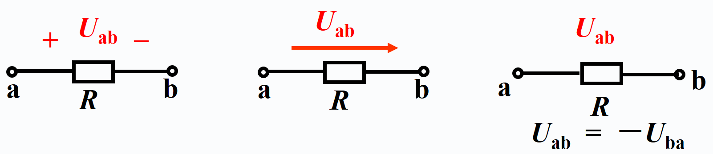
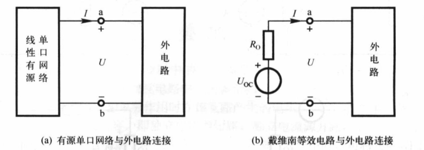

# 第一章 直流电路

## 1.1 电路及电路模型

略

## 1.2 电路变量

### 1.2.1 电流和电流的参考方向

**参考方向都是假定的方向**

- 电流强度 $i(t)$ 的数学表达式为 $i(t)=\frac{\mathrm{d} q}{\mathrm{~d} t}$
- 直流电为 DC
- 交流电为 AC

### 1.2.2 电压和电压的参考方向

电压$u(t)$ 的数学表达式为 $u(t)=\frac{\mathrm{d} w}{\mathrm{~d} q}$

直流电压为 $U$,时变电压为 $u$

电压**实际的方向**：电位降的方向

**参考方向（极性）**：是为了方便分析和运算，任意*假定*的电压方向，简称方向

**参考方向的三种表示方法**：正负极性（参考方向是由正极性指向负极性）、箭头和双下标，如下图所示

#### 关联参考方向

- 当电流的参考方向和电压的参考极性**一致**，则称为**关联参考方向**
- 相反，则称为**非关联参考方向**
- 谈关联参考方向，必须明确是对**哪个元件**而言

### 1.2.3 功率和能量

电功率是指单位时间内元件吸收或发出的电能，简称**功率**（p）

对任意一个二端元件（或二端电路），当电压与电流*为关联参考方向*时有
$$
p=ui
$$

如果是直流电压和电流，则用大写
$$
P=UI
$$
当电压与电流为非关联参考方向时有
$$
p=-ui
$$
计算出来的功率：
$$
\boldsymbol{p}\left\{\begin{array}{ll}
>\mathbf{0} & \text { 吸收功率 }(\text { 负载 }) \\
<\mathbf{0} & \text { 提供功率 }(\text { 电源 })
\end{array}\right.
$$

## 1.3 电阻元件

欧姆定律：
$$
R=\frac{u}{i}\quad or\quad u=Ri
$$
伏安特性：可以用来区分线性电阻和非线性电阻

**电导**（G）：电阻的倒数
$$
G=\frac{1}{R}
$$
**开路**：$R\rightarrow\infty$ 时，电阻元件呈现开路状态，电流恒等于零

**短路**：$R\rightarrow0$ 时，电阻元件呈现短路状态，电压恒等于零

可调式电阻通常称为**电位器**

## 1.4 电压源与电流源

### 1.4.1 理想电压源

电压源的电压可以为零，相当于**短路**

### 1.4.2 理想电流源

电流源的电流可以为零，表示**断路**

### 1.4.3 实际电源的两个电路模型

#### 1. 实际电压源

- 其电阻 RS 称为电源的内电阻
- 其**伏安特性**为 $U=U_{\mathrm{s}}-R_{\mathrm{S}} I$
- 实际电流源的外特性是工作电压 U 随着电流的增加而下降

#### 2. 实际电流源

- 其**伏安特性**为 $I=I_{\mathrm{S}}-\frac{U}{R_{\mathrm{S}}}$

## ==1.5 基尔霍夫定律==

- **支路**：每一个两端元件视为一个支路
- **节点**：两条或者两条以上支路的连接点称为节点
- **回路**：电路中任一闭合路径称为回路
- **网孔**：在回路内部不另含支路的回路称为网孔

### 1.5.1 基尔霍夫电流定律（KCL）

#### 定义

在电路中，在任一时刻，对任一**节点**（包括广义节点），流入/流出该节点的所有电流的代数和等于零，即 $\sum I=0$

### 1.5.2 基尔霍夫电压定律（KVL）U

#### 定义

在电路中，在任一时刻，对任一**回路**（包括广义回路），该回路各元件两端的电压的代数和为零，即$\sum U=0$

p.s. 元件两端的电压方向与回路绕行方向相同时取正好，相反则取负号

## 1.6 单口网络及等效

单口网络又称**二端网络**，是指只有一个端口（一对端钮）与外部电路连接的电路

### 1.6.1 电阻的串并联及等效

串联电路的等效电阻为 $R=R_{1}+R_{2}+\cdots+R_{n}=\sum_{i=1}^{n} R_{i}$；第 k 个电阻的电压为 $U_{k}=\frac{R_{k}}{\sum_{i=1}^{n} R_{i}} U$

并联电路的等效电阻为 $\frac{1}{R}=\frac{1}{R_{1}}+\frac{1}{R_{2}}+\cdots+\frac{1}{R_{n}}$ 

## 1.7 电位的概念

- 电路中某点**电位**指的是该点与<u>参考点之间</u>的**电压** 
- 电路中有且只有一个参考点，通常选择接地的点作为**参考点**
- 利用电位可以将电路简化

## 1.8 支路电流分析法

以<u>支路电流为**求解变量**</u>的分析方法为支路电流分析法

假设电路具有 n 个节点，b 条支路，则应根据基尔霍夫定律列出 b 个独立方程，其过程如下

1. 标出每个支路电流以及参考方向
2. 根据 KCL 列出 n - 1 个独立的节点电流方程
3. 选定所有独立回路并指定回路的绕行方向，再根据 KVL 列出 b - (n - 1) 个回路电压方程
4. 求解

## 1.9 节点分析法

1. 在电路中任选一个节点作为参考节点（设此节点电位为零），则其他节点到参考节点的电压称为该节点的节点电压
2. 以<u>节点电压为**未知量**</u>，将各支路电流用节点电压表示
3. 利用 KCL 列出独立的电流方程求解

## 1.10 叠加定理

在线性电路中，由多个独立电源共同作用在某一支路产生的电压（或电流）等于电路中每个独立电源单独作用在该支路产生的电压（或电流）的**代数和**

## 1.11 等效电源定理

把待求支路从网络中拉出来，把它看作外部电路，其余部分则是线性有源单口网络

### 1.11.1 戴维南定理

任意一个线性有源单口网络，就其对外部电路的作用而言，总可以用一个理想电压源和一个电阻串联的支路来等效，如图：

则伏安关系为：$U=U_{\mathrm{OC}}-R_{\mathrm{O}} I$