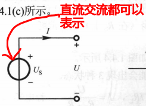
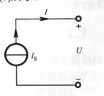
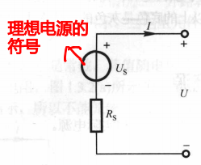
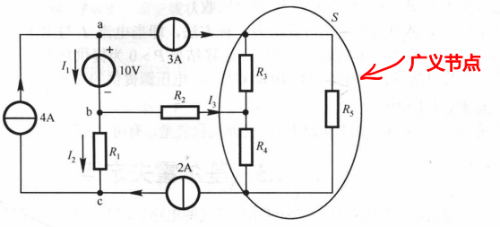
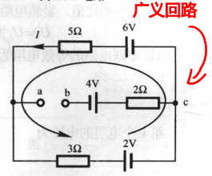
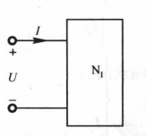

# 第一章 直流电路

## 1.1 电路及电路模型

略

## 1.2 电路变量

### 1.2.1 电流和电流的参考方向

- 电流强度 $i(t)$ 的数学表达式为 $i(t)=\frac{\mathrm{d} q}{\mathrm{~d} t}$
- 直流电为 DC
- 交流电为 AC

### 1.2.2 电压和电压的参考方向

- 电压$u(t)$ 的数学表达式为 $u(t)=\frac{\mathrm{d} w}{\mathrm{~d} q}$
- 直流电压为 $U$,时变电压为 $u$

#### 关联参考方向

- 当电流的参考方向和电压的参考极性一致，则称为**关联参考方向**
- 相反，则称为**非关联参考方向**

### 1.2.3 功率和能量

- 电功率 $p(t)$ 的数学表达式为 $p(t)=\frac{\mathrm{d} w}{\mathrm{~d} t}\Rightarrow P=UI$ （非关联时为 $P=-UI$）
- 吸收功率 = $-$ 产生功率（P>0 为吸收功率；P<0 为产生功率）

## 1.3 电阻元件

- $u=Ri$

## 1.4 电压源与电流源

### 1.4.1 理想电压源

电压源的电压可以为零，相当于**短路**

### 1.4.2 理想电流源

电流源的电流可以为零，表示**断路**

### 1.4.3 实际电源的两个电路模型

#### 1. 实际电压源

- 其电阻 RS 称为电源的内电阻
- 其**伏安特性**为 $U=U_{\mathrm{s}}-R_{\mathrm{S}} I$
- 实际电流源的外特性是工作电压 U 随着电流的增加而下降

#### 2. 实际电流源

- 其**伏安特性**为 $I=I_{\mathrm{S}}-\frac{U}{R_{\mathrm{S}}}$

## ==1.5 基尔霍夫定律==

- **支路**：每一个两端元件视为一个支路
- **节点**：两条或者两条以上支路的连接点称为节点
- **回路**：电路中任一闭合路径称为回路
- **网孔**：在回路内部不另含支路的回路称为网孔

### 1.5.1 基尔霍夫电流定律（KCL）

#### 定义

在电路中，在任一时刻，对任一**节点**（包括广义节点），流入/流出该节点的所有电流的代数和等于零，即 $\sum I=0$

### 1.5.2 基尔霍夫电压定律（KVL）U

#### 定义

在电路中，在任一时刻，对任一**回路**（包括广义回路），该回路各元件两端的电压的代数和为零，即$\sum U=0$

p.s. 元件两端的电压方向与回路绕行方向相同时取正好，相反则取负号

## 1.6 单口网络及等效

单口网络又称**二端网络**，是指只有一个端口（一对端钮）与外部电路连接的电路

### 1.6.1 电阻的串并联及等效

串联电路的等效电阻为 $R=R_{1}+R_{2}+\cdots+R_{n}=\sum_{i=1}^{n} R_{i}$；第 k 个电阻的电压为 $U_{k}=\frac{R_{k}}{\sum_{i=1}^{n} R_{i}} U$

并联电路的等效电阻为 $\frac{1}{R}=\frac{1}{R_{1}}+\frac{1}{R_{2}}+\cdots+\frac{1}{R_{n}}$ 

## 1.7 电位的概念